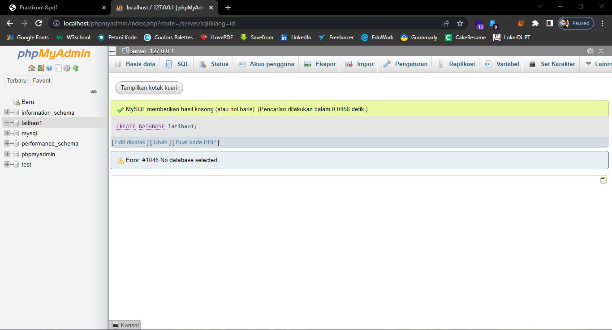
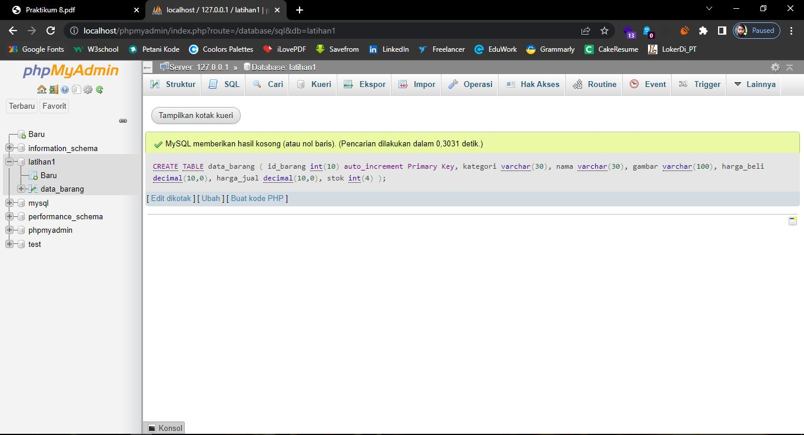
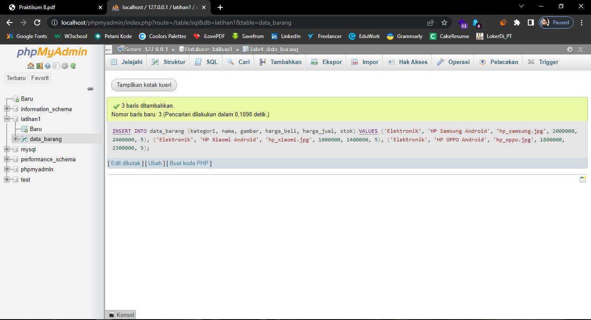
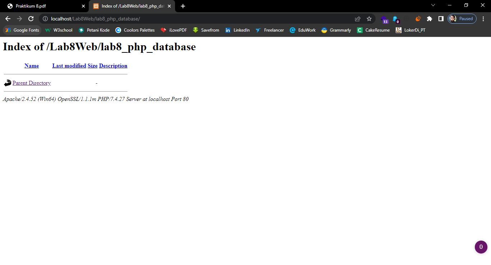
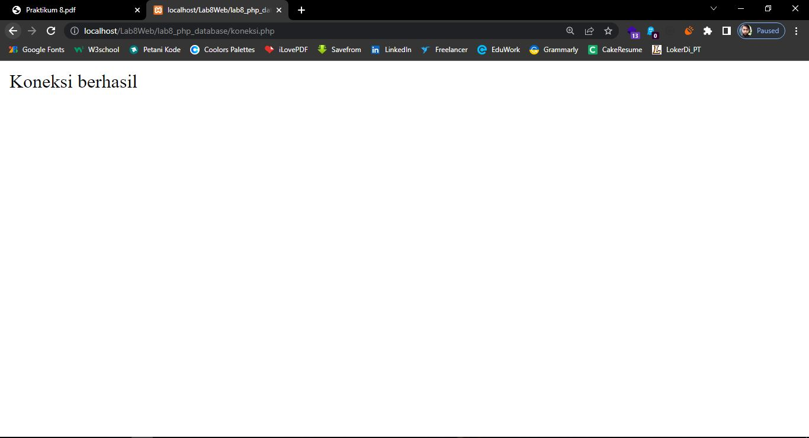
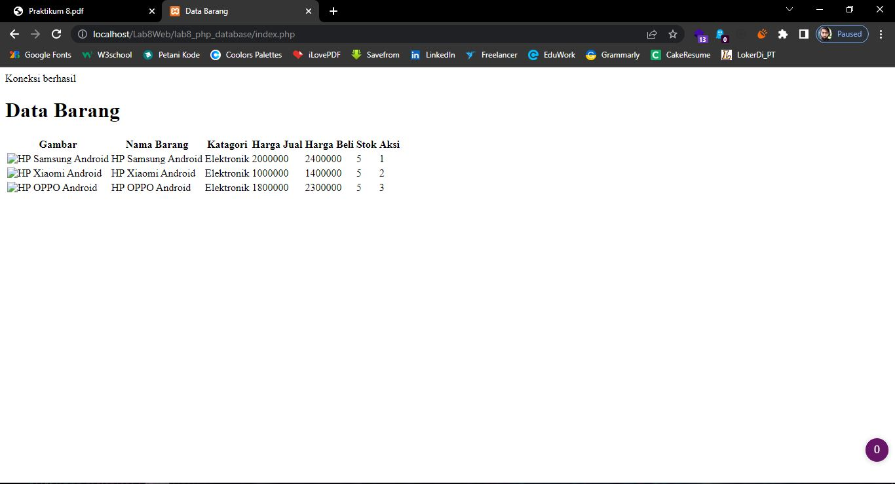
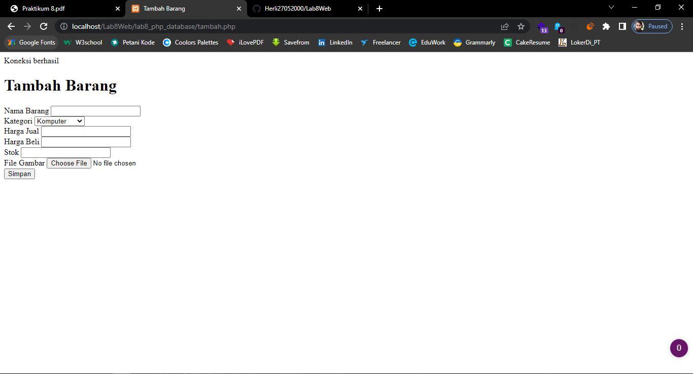
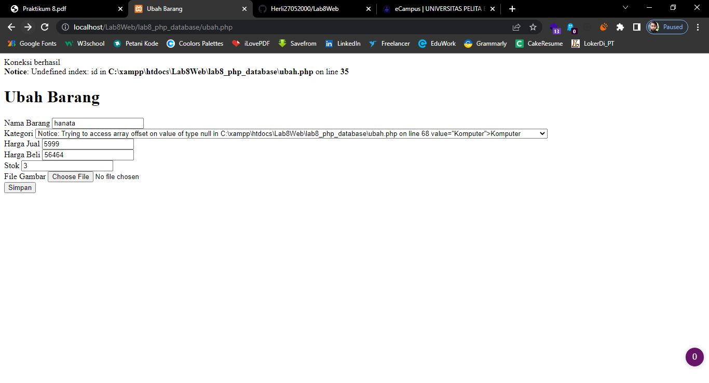

# Latihan Praktikum 8

## membuat database
***hasilnya:***

## membuat tabel
***hasilnya:***

## menambahkan data
***hasilnya:***

## membuat program CRUD
***hasilnya:***

## membuat file koneksi database
***hasilya:***

## membuat file index untuk menampilkan data (read)
***hasilnya:***

## menambahkan data
***hasilnya:***

## mengubah data
***hasilnya:***
